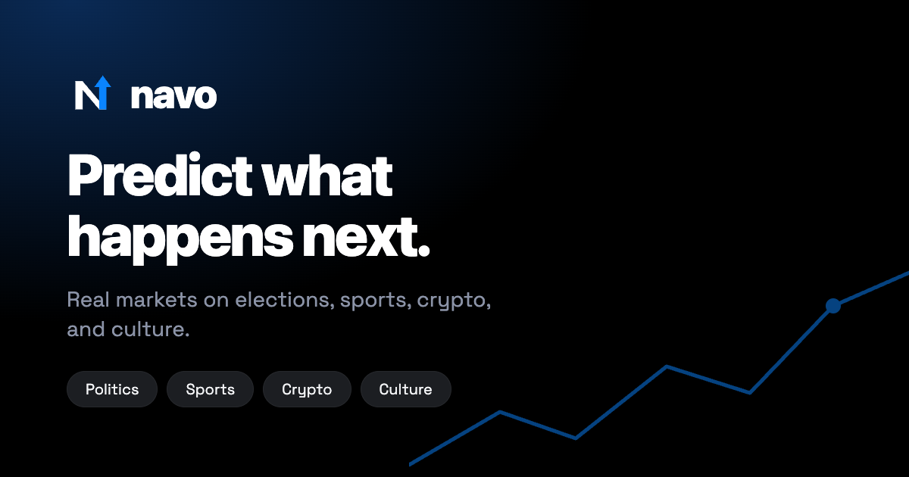
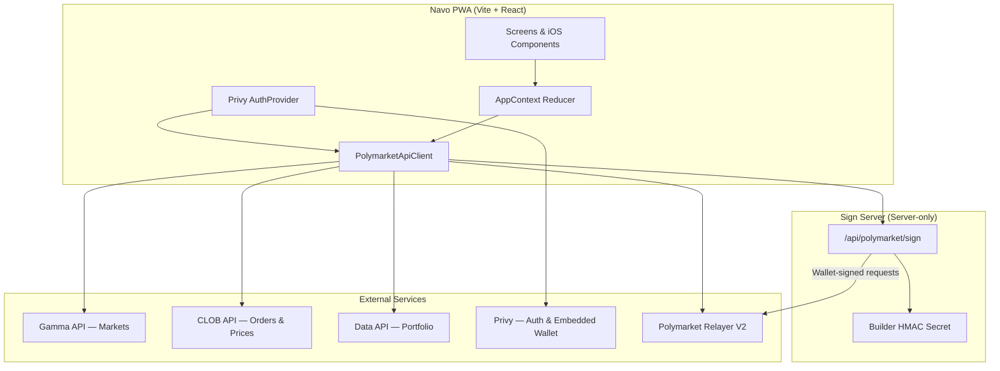
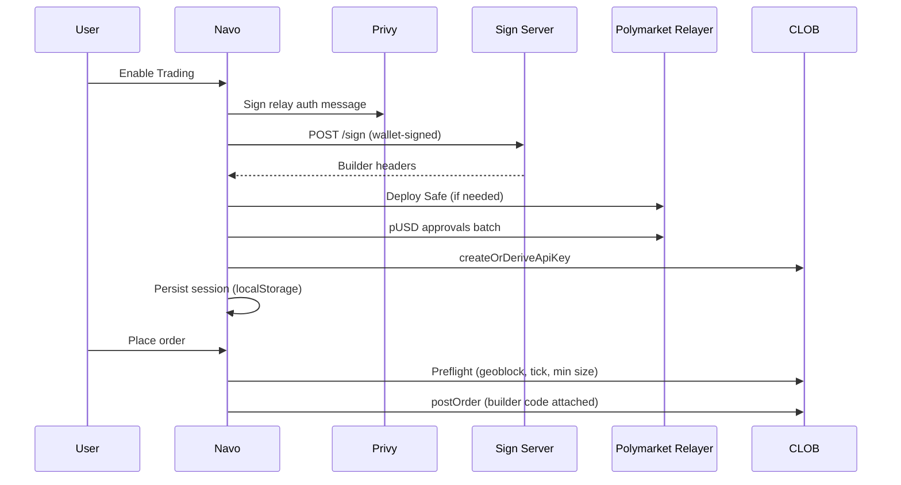

<p align="center">
  
</p>

<h1 align="center">Navo</h1>

<p align="center">
  <strong>Enterprise-grade prediction markets client for Polymarket</strong><br/>
  Native iOS design · Privy auth · Gnosis Safe trading · Installable PWA
</p>

<p align="center">
  <a href="https://navomarkets.vercel.app"><strong>Live Demo → navomarkets.vercel.app</strong></a>
</p>

<p align="center">
  
  
  
  
  
  
  
</p>

<p align="center">
  
</p>

---

## Overview

**Navo** is a production-ready progressive web application that delivers a first-class mobile experience for [Polymarket](https://polymarket.com) prediction markets. Built with zero UI framework dependencies, it implements Apple's Human Interface Guidelines, Liquid Glass materials, and SF Pro typography — while integrating Privy embedded wallets, Polymarket CLOB V2, and a hardened builder signing pipeline.

| | |
|---|---|
| **Primary use** | Browse, trade, and manage prediction-market positions |
| **Chain** | Polygon (USDC.e → pUSD collateral) |
| **Wallet model** | Privy embedded EOA + Polymarket Gnosis Safe |
| **Distribution** | PWA (Add to Home Screen), optional Capacitor native shells |
| **Design language** | Apple HIG · Navo brand system · Dark-first |

---

## Table of Contents

- [Features](#features)
- [Screenshots](#screenshots)
- [Architecture](#architecture)
- [Repository Structure](#repository-structure)
- [Tech Stack](#tech-stack)
- [Quick Start](#quick-start)
- [Configuration](#configuration)
- [Authentication & PWA](#authentication--pwa)
- [Trading Pipeline](#trading-pipeline)
- [Design System](#design-system)
- [Security](#security)
- [Deployment](#deployment)
- [Testing & CI](#testing--ci)
- [Documentation](#documentation)
- [Acknowledgments](#acknowledgments)

---

## Features

### Markets & Discovery
- Live catalog from Gamma Events API with tradability filtering (no expired/resolved bleed-through)
- Real-time CLOB price WebSocket feed with pull-to-refresh
- Category chips, full-text search, watchlist with local persistence
- Binary and multi-outcome markets with order book, price chart, and activity feed

### Trading
- Gnosis Safe deploy via Polymarket Builder Relayer (`POLY_GNOSIS_SAFE`)
- pUSD wrap/unwrap funding path (USDC.e → Safe → pUSD)
- CLOB V2 exchange approvals (CTF Exchange, Neg Risk, collateral adapters)
- Market and limit orders with geoblock preflight, tick-size validation, and min-size checks
- Builder code attribution on all orders

### Identity & Wallet
- Branded sign-in sheet: Apple · Google · Email OTP (headless Privy OAuth)
- Privy embedded wallet on Polygon with automatic Safe provisioning
- Session-scoped CLOB API credentials (cleared on logout)
- Optional Face ID / biometric app lock (Capacitor)

### Platform
- Installable PWA with maskable icons, offline shell caching, and standalone display mode
- iOS Add to Home Screen optimized (Apple Sign In, black icon tile, safe-area insets)
- Capacitor 7 scaffold for App Store / Play Store distribution
- Light / dark / system theme with grouped list surfaces

---

## Screenshots

| Markets | Market detail | Portfolio |
|---------|---------------|-----------|
| Live catalog with category filters, real-time prices, and watchlist | Order book, price chart, activity feed, and ticket sheet | Positions, P&amp;L, and trading session status |

| Sign in | PWA install |
|---------|-------------|
| Branded bottom sheet — Apple, Google, Email OTP | Add to Home Screen with maskable icons and standalone mode |

> **Live preview:** [navomarkets.vercel.app](https://navomarkets.vercel.app) · Marketing assets in [`public/marketing/`](./public/marketing/)

---

## Architecture



**Data flow principles**
1. All network I/O flows through `PolymarketApiClient` — no ad-hoc fetches in UI components.
2. Builder HMAC secret never leaves the sign server; browser receives signatures only after EIP-191 wallet authorization.
3. Trading session state (Safe address, CLOB creds) is device-local and versioned (`SESSION_VERSION`).

See [docs/ARCHITECTURE.md](./docs/ARCHITECTURE.md) for module-level detail.

---

## Repository Structure

```
foresight-app/
├── api/                      # Vercel serverless (sign + health)
│   ├── polymarket/
│   │   ├── sign.js           # Builder HMAC endpoint (wallet-gated)
│   │   └── health.js         # Sign server health probe
│   └── _lib/                 # Security, wallet auth, HMAC utils
├── public/                   # Static assets (brand, PWA icons, OG image)
│   ├── site.webmanifest
│   ├── og.png
│   └── marketing/
├── server/
│   └── sign.mjs              # Local dev sign server (Docker/Railway parity)
├── src/
│   ├── api/                  # Service layer
│   │   ├── client.ts         # PolymarketApiClient facade
│   │   ├── polymarket.ts     # Gamma / CLOB / Data mappers
│   │   └── trading/          # Session, transfers, approvals, preflight
│   ├── auth/                 # Privy provider + sign-in orchestration
│   ├── components/
│   │   ├── auth/             # SignInSheet (Apple / Google / Email)
│   │   ├── brand/            # NavoMark, lockups
│   │   └── ios/              # HIG controls (GroupedList, SearchField…)
│   ├── screens/              # Route-level views
│   ├── theme/                # Palettes, typography tokens, brand
│   └── store/                # AppContext global reducer
├── docs/                     # Extended documentation
├── .github/workflows/        # CI pipeline
├── SECURITY.md
├── DEPLOY.md
└── vercel.json               # SPA rewrites + security headers
```

---

## Tech Stack

| Layer | Technology |
|-------|------------|
| UI | React 18, TypeScript, inline styles (no Tailwind/MUI) |
| Build | Vite 6, vite-plugin-pwa |
| Auth | Privy (`@privy-io/react-auth`) |
| Chain | viem, Polygon mainnet |
| Trading | `@polymarket/clob-client-v2`, `@polymarket/builder-relayer-client` |
| Native | Capacitor 7 (optional) |
| Deploy | Vercel (frontend + serverless sign), Railway/Fly (standalone sign) |
| Test | Vitest |

---

## Quick Start

### Prerequisites

- **Node.js** ≥ 20
- **npm** ≥ 10
- [Privy](https://dashboard.privy.io) app with Apple, Google, and Email enabled
- [Polymarket Builder](https://polymarket.com/settings?tab=builder) credentials (for trading)

### Install & run

```bash
git clone <repository-url>
cd foresight-app
npm install
cp .env.example .env.local
```

Edit `.env.local`:

```env
VITE_PRIVY_APP_ID=your_privy_app_id
POLYMARKET_BUILDER_API_KEY=...
POLYMARKET_BUILDER_SECRET=...
POLYMARKET_BUILDER_PASSPHRASE=...
VITE_POLYMARKET_BUILDER_CODE=0x...
```

Start development (Vite + local sign server):

```bash
npm run dev
# → http://localhost:5173
```

App-only (no trading sign server):

```bash
npm run dev:app
```

### Scripts

| Command | Description |
|---------|-------------|
| `npm run dev` | Sign server + Vite dev server with API proxy |
| `npm run dev:app` | Frontend only |
| `npm run build` | Typecheck + production bundle |
| `npm run preview` | Serve `dist/` locally |
| `npm test` | Vitest unit tests |
| `npm run cap:ios` | Build + open Xcode (Capacitor) |
| `npm run cap:android` | Build + open Android Studio |

---

## Configuration

### Environment variables

| Variable | Scope | Required | Description |
|----------|-------|----------|-------------|
| `VITE_PRIVY_APP_ID` | Client | **Yes** | Privy application ID |
| `VITE_POLYMARKET_BUILDER_CODE` | Client | Trading | Builder attribution code (bytes32 hex) |
| `VITE_POLYMARKET_SIGN_URL` | Client | Prod | Sign endpoint (`/api/polymarket/sign` or external) |
| `VITE_POLYMARKET_BUILDER_HEALTH_URL` | Client | Prod | Health probe URL |
| `VITE_POLYMARKET_GAMMA_API` | Client | No | Gamma API override |
| `VITE_POLYMARKET_CLOB_API` | Client | No | CLOB API override |
| `VITE_POLYMARKET_DATA_API` | Client | No | Data API override |
| `VITE_POLYGON_RPC_URL` | Client | No | Polygon RPC for reads |
| `POLYMARKET_BUILDER_API_KEY` | **Server** | Trading | Builder API key |
| `POLYMARKET_BUILDER_SECRET` | **Server** | Trading | Builder HMAC secret (never `VITE_`) |
| `POLYMARKET_BUILDER_PASSPHRASE` | **Server** | Trading | Builder passphrase |
| `ALLOWED_ORIGINS` | Server | Prod | Comma-separated CORS allowlist |
| `SIGN_REQUIRE_WALLET_AUTH` | Server | Prod | Require wallet signature (default `true`) |

> **Never** prefix secrets with `VITE_` — Vite inlines those into the client bundle.

Full template: [`.env.example`](./.env.example)

---

## Authentication & PWA

### Sign-in flow

Navo uses a custom **SignInSheet** (not the default Privy modal) for the primary path:

1. **Apple** — prioritized on iOS and installed PWAs
2. **Google** — OAuth redirect
3. **Email** — OTP code entry inline
4. **More options** — falls back to Privy modal

After OAuth, Privy provisions an embedded wallet; Navo waits up to 15s for wallet readiness before entering the app.

### PWA installation

| Platform | Steps |
|----------|-------|
| **iOS Safari** | Share → Add to Home Screen → open standalone app |
| **Android Chrome** | Install prompt or menu → Install app |

Manifest: `public/site.webmanifest` · Icons: 192/512 + maskable · Theme: `#000000`

### Privy dashboard checklist

1. Allowed origins: `http://localhost:5173`, `https://navomarkets.vercel.app`
2. Login methods: Email, Google, Apple
3. Apple Services ID configured for your production domain

---

## Trading Pipeline



Session migration: `SESSION_VERSION = 3` (Gnosis Safe). Legacy deposit-wallet sessions are cleared on load.

Details: [docs/TRADING.md](./docs/TRADING.md)

---

## Design System

Navo implements a custom iOS-native design system without third-party UI libraries.

| Token | Value | Usage |
|-------|-------|-------|
| `--navo-blue` | `#0A84FF` | CTAs, links, brand accent |
| `--navo-sky` | `#4DA3FF` | Header lockup |
| `--navo-yes` / `--navo-no` | `#34C759` / `#FF453A` | Market outcomes only |
| Grouped radius | `10pt` | Settings-style lists |
| Min touch target | `44pt` | HIG compliance |

Components: `LargeTitle`, `GroupedList`, `SearchField`, `SignInSheet`, `NavoMark`

Full reference: [docs/DESIGN_SYSTEM.md](./docs/DESIGN_SYSTEM.md)

---

## Security

- Builder HMAC secret isolated on server
- Wallet-signed requests required for `/sign`
- Path allowlist (relayer routes only)
- CORS restricted to Navo origins in production
- Rate limiting (40 req/min/IP)
- Security headers via `vercel.json` (HSTS, X-Frame-Options, nosniff)
- Logout clears CLOB credentials from device storage

Read [SECURITY.md](./SECURITY.md) before deploying to production.

---

## Deployment

| Component | Target | Guide |
|-----------|--------|-------|
| Frontend PWA | Vercel | [DEPLOY.md §2](./DEPLOY.md) |
| Sign server | Vercel serverless or Railway/Fly | [DEPLOY.md §1](./DEPLOY.md) |
| Native apps | Capacitor | [DEPLOY.md §5](./DEPLOY.md) |

Production URL: **https://navomarkets.vercel.app**

```bash
# Production build
npm run build

# Deploy (Vercel CLI)
vercel --prod
```

---

## Testing & CI

```bash
npm test          # unit tests
npm run build     # typecheck + bundle
```

GitHub Actions (`.github/workflows/ci.yml`):
- `npm ci`
- `npm test`
- `npm run build`
- Sign server health check on port 8787

---

## Documentation

| Document | Description |
|----------|-------------|
| [docs/ARCHITECTURE.md](./docs/ARCHITECTURE.md) | Module boundaries, state management, API layer |
| [docs/TRADING.md](./docs/TRADING.md) | Safe deploy, funding, orders, session lifecycle |
| [docs/DESIGN_SYSTEM.md](./docs/DESIGN_SYSTEM.md) | Typography, color, components, brand rules |
| [DEPLOY.md](./DEPLOY.md) | Production deployment runbook |
| [SECURITY.md](./SECURITY.md) | Threat model and hardening checklist |
| [CONTRIBUTING.md](./CONTRIBUTING.md) | Development conventions |

---

## Acknowledgments

- [Polymarket](https://polymarket.com) — CLOB, Gamma, and Builder APIs
- [Privy](https://privy.io) — Embedded wallet and social auth
- Apple [Human Interface Guidelines](https://developer.apple.com/design/human-interface-guidelines)

---

<p align="center">
  <sub>Navo is an independent client for Polymarket. Not affiliated with Polymarket Labs.</sub><br/>
  <sub>Licensed under <a href="./LICENSE">MIT</a></sub>
</p>
